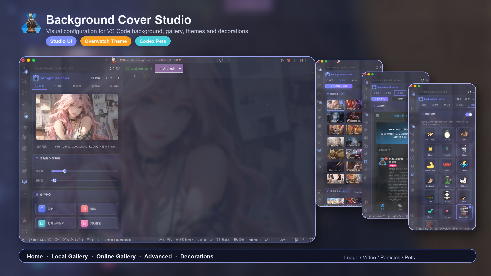

<h1 align="center">
     
    VS Code - Background Cover
</h1>

    <b>让你喜欢的图片或视频铺满 VS Code，支持粒子动画、热更新、视频背景、自动轮播等丰富特性</b> 
    

## 🚀 3.5.0 主要更新

1. **🎉 全新 Studio 面板**：整合首页、在线图库、本地图库、高级设置与装饰效果，配置背景更直观。
2. **🖼️ 本地/在线图库增强**：支持本地文件夹预览、最近使用、分页浏览；输入 URL 统一移动到在线页顶部。
3. **🎮 主题选择**：默认主题之外新增守望主题，提供偏游戏 HUD 的橙蓝高对比配置体验。
4. **🐾 宠物系统增强**：支持自动同步本机 Codex 宠物，并可自定义顶部小宠物冒泡文案。
5. **🧩 AgentView 支持**：支持 VS Code AgentView / Agent Sessions 独立窗口背景显示。
6. **🛠️ 热更新更稳定**：优化 CSS 写入、刷新触发与并发控制，快速切换背景时不再被旧任务覆盖。
7. **✨ 在线随机图优化**：手动刷新和自动轮播会重新获取远程图片，随机图 API 不再长期复用旧缓存。
8. **📦 包体积优化**：排除 webview 开发依赖和源码，VSIX 包体大幅减小。
9. **🍎 macOS 修复**：修复赞助作者按钮无法打开的问题。

---

## 🌟 功能特性

- **Studio 配置面板**：首页、本地图库、在线图库、高级设置、装饰效果集中管理。
- **界面主题**：支持默认主题和守望主题，可在面板右上角切换。
- **顶部小宠物**：内置多款可爱宠物，支持同步 `~/.codex/pets` / `CODEX_HOME/pets` 中的 Codex 宠物，并可自定义多行冒泡文案。
- **图片/视频背景**：支持本地图片、网络图片、本地视频、在线视频。
- **热更新**：切换背景即刻生效，无需重启 VS Code。
- **AgentView 支持**：支持 VS Code AgentView / Agent Sessions 独立窗口背景显示。
- **自动轮播**：多张图片/视频可定时自动切换。
- **粒子动画**：集成鼠标跟随粒子特效，支持数量、透明度、预设颜色和自定义颜色。
- **本地图库**：支持文件夹图片预览、最近使用记录、分页浏览和拖拽设置背景。
- **在线入口**：在线页顶部支持输入 URL、刷新在线图库和浏览器打开社区图库。
- **可视化配置**：左侧 Studio 面板一键设置，支持中英双语。
- **透明度/模糊/填充模式**：自定义背景透明度、模糊度、填充方式。
- **高级解析**：支持 JSON API、静态 HTML、图库帖子等多种图片源。
- **在线图库**：内置社区壁纸浏览、上传与一键应用。
- **跨平台支持**：兼容 Windows、MacOS、Linux 及 Code-Server。
- **自动权限处理**：Windows 下自动获取写入权限，无需手动操作。

## ⚠️ 注意事项

> 本插件通过修改 VS Code 内部文件实现效果。

1. **首次使用/升级到 3.x**：需重新获取权限（Hook），并重启一次 VS Code。
2. **初次安装/更新**：如遇“安装损坏”提示，请点击【不再提示】。
3. **背景重叠/异常**：升级后如遇背景重叠，请重启 VS Code。
4. **还原方法**：如 VS Code 无法打开，请手动还原：
   - 路径：`Microsoft VS Code\resources\app\out\vs\workbench\`
   - 将 `workbench.desktop.main.js.bak` 重命名为 `workbench.desktop.main.js`

## 🖼️ 效果展示

[在线图库/更多壁纸](https://vs.20988.xyz/d/24-vscodebei-jing-tu-tu-ku)

## ⚙️ 配置方式

> **推荐**：点击左侧活动栏的 `Background Cover` 图标，打开可视化配置面板，所有设置一目了然。

- **图片/视频源**：支持本地文件、文件夹、网络链接。
- **外观**：调整透明度、模糊度、填充模式。
- **在线**：输入 URL、浏览在线图库、刷新社区图库。
- **装饰**：配置粒子特效、顶部小宠物、Codex 宠物同步和宠物冒泡文案。
- **高级**：配置自动轮播、混合模式和缓存目录。

*也可通过命令面板 `Ctrl + Shift + P` -> `backgroundCover - start` 进入设置*

## 📝 快捷键与使用

- **切换背景**：点击底部状态栏按钮
- **打开/配置**：`Ctrl + Shift + P` -> `backgroundCover - start`
- **重新应用**：VS Code 更新后如背景消失，请重新设置

> **首次升级到 3.x 必须重新授权并重启 VS Code 才能生效！**

## 🗑️ 卸载说明

1. 禁用/卸载插件
2. 重启 VS Code
3. 插件会自动清理残留背景

## ❓ 常见问题

**Q: 安装后无反应？**
A: 请确保有管理员权限（右键 VS Code 图标 -> 以管理员身份运行）。

**Q: Mac 如何授权？**
A: 插件会自动请求密码，或手动 `sudo chown` 相关文件。

---

## 📝 更新日志

[完整日志](https://github.com/vscode-extension/vscode-background-cover/blob/master/CHANGELOG.md)

#### ver 3.5.0 (2026/05/23)

1. 支持 VS Code AgentView / Agent Sessions 独立窗口背景显示 ([#197](https://github.com/AShujiao/vscode-background-cover/pull/197) by @MaxQian888)。
2. 新增 Vue 驱动的 Studio 可视化配置面板。
3. 新增默认/守望界面主题切换。
4. 新增本地图库预览、最近使用、分页浏览和拖拽设置背景。
5. 新增本机 Codex 宠物同步，支持 `~/.codex/pets` 与 `CODEX_HOME/pets`。
6. 新增宠物冒泡文案自定义功能，支持多行配置，留空使用预置文案。
7. 在线页顶部新增输入 URL 入口，本地页聚焦本地文件与目录管理。
8. 优化背景热更新、在线随机图缓存与快速切换并发控制。
9. 修复 macOS 下赞助作者按钮无法打开的问题。
10. 优化 VSIX 打包配置，显著减小包体。

---

### 致谢

- [vscode-background](https://github.com/shalldie/vscode-background)
- [feature_restart_random_image](https://github.com/AShujiao/vscode-background-cover/pull/2)
- [Canvas-nest.js](https://github.com/hustcc/canvas-nest.js) 网页粒子背景插件

## 贡献者
默认展示所有贡献者，如需移除请提交 PR。

### 相关信息

- [GitHub](https://github.com/AShujiao/vscode-background-cover)
- [Visual Studio Marketplace](https://marketplace.visualstudio.com/items?itemName=manasxx.background-cover)

**赞助作者**
> 如果插件对你有帮助，欢迎请作者喝杯咖啡~

## 📄 许可证
本项目采用 [MIT 许可证](LICENSE) 进行许可。
